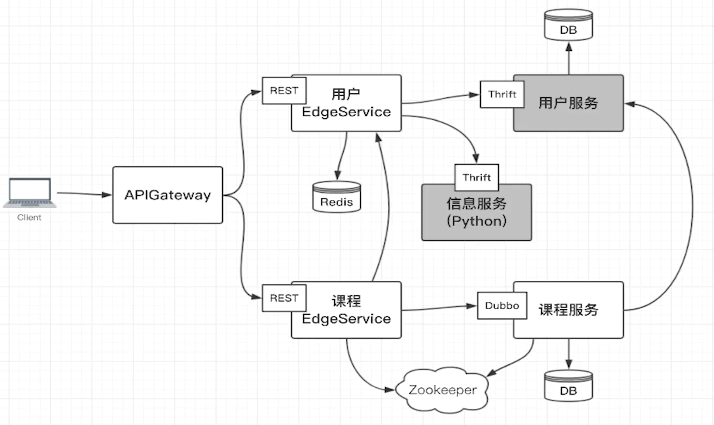
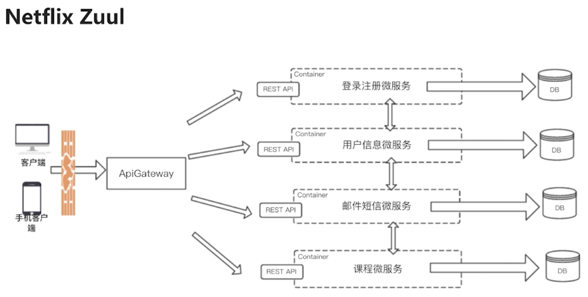

# 项目架构



#### 什么是微服务
- 使用一套小服务来开发单个应用的方式
- 每个服务运行在独立的进程里
- 一般采用轻量级的通讯机制互联
- 可以通过自动化的方式部署

#### 微服务的特征
- 单一职责
- 轻量级通讯（平台无关、语言无关）
- 隔离性
- 有自己的数据，业务数据独立
- 技术多样性

#### 微服务诞生背景
- 互联网行业的快速发展
- 敏捷开发，精益方法深入人心
- 容器技术成熟

#### 微服务架构的优势
- 独立性
- 敏捷性
- 技术栈灵活
- 高效团队

#### 微服务架构的不足
- 额外的工作：服务的拆分
- 数据的一致性
- 沟通成本

#### 微服务架构引入的问题
- 微服务之间如何通讯
- 微服务如何发现彼此
- 微服务怎样部署、更新、扩容

#### 微服务之间如何通讯

**从通讯模式角度考虑**

|  | 一对一 | 一对多 |
| - | :-: | :-: |
| 同步 | 请求相应模式，最常见| 无 |
| 异步 | 通知/请求异步相应 | 发布订阅/发布异步相应 |

**从通讯协议角度考虑**
- Socket
- RestAPI
- MQ
- RPC：dubbo、motan、GRPC、thrift

**如何选择RPC框架**
- I/O：同步/异步
- 线程调度模型：长连接/短连接
- 序列化方式：可读的（xml、json）/二进制
- 多语言支持
- 服务治理（集群的部署、服务的高可用）

**流行的RPC框架**
- Dubbo（阿里）/Dubbox（当当）：有服务治理，默认使用python进行序列化，只支持JAVA
- Motan（新浪微博）：有服务治理，使用python进行序列化，只支持JAVA
- Thrift（Apache）：跨语言，没有服务治理
- GRPC（Google）：跨语言，没有服务治理

| RPC对比 | Dubbo | Motans | Thrift | GRPC |
| - | :-: | :-: | :-: | :-: |
| 开发语言 | Java | Java | 跨语言 | 跨语言 |
| 服务治理 | √ | √ | × | x |
| 多种序列化 | √ | √ | 只支持thrift | 只支持protobuf |
| 多种注册中心 | √ | √ | x | x |
| 管理中心 | √ | √ | x | x |
| 跨语言通讯 | x | x | √ | √ |
| 整体性能 | 3 | 4 | 5 | 3 |

#### 服务发现
- 客户端发现：服务端向注册中心注册，客户端从注册中心获取服务接口
- 服务端发现

---

#### SpringBoot的使命
- 化繁为简

#### SpringBoot的核心功能
- 独立运行 java -jar xx.jar
- 内嵌web服务器
- 简化配置，自动化、通过starter简化maven的配置
- 准生产的应用监控

#### SpringBoot与微服务的关系
- Java开发微服务的润滑剂

#### SpringCloud的使命
- 简化Java的分布式系统：统一的配置管理、服务的注册、服务的发现、服务之间的调用、负载均衡、全局锁、分布式session等
- 一系列框架的集合
- 简化java的分布式系统、基础设施的开发，风格统一
- SpringBoot的封装，基于SpringBoot的分布式开发工具

#### SpringCloud VS SpringBoot
- SpringBoot意在简化配置，是一种开发配置风格
- SpringCloud意在简化分布式，是分布式系统的一站式解决方案，是功能的集合、风格的统一

#### SpringCloud VS 微服务
- Java的微服务解决方案
- 侧重功能和开发

#### SpringCloud的核心组件
- Netflix Eureka 服务发现组件、注册中心
- Netflix Ribbon 客户端负载均衡组件
- Netflix Hystrix 调度器
- Netflix Zuul 服务网关
- SpringCloud Config 分布式配置

#### 业务场景
- 单点登录，用户可以注册和登录
- 微服务架构下的应用是无状态的，避免使用session
- 登录用户可以对课程进行CRUD操作

#### 用户服务
- 用户登录
- 用户注册
- 用户基本信息查询
- 无状态（无session)
- 单点登录（SSO）

#### 课程服务
- 登录验证
- 课程的CRUD

#### 信息服务
- 发送邮件
- 发送短信

#### 用户edgeservice

#### 课程edgeservice

#### API GATEWAY
- 项目的入口
- 封装内部的系统架构，提供API给客户端
- 可以提供附加功能，如监控、缓存、负载均衡等


- 定义监听端口
transport = TSocket.TServerSocket("localhost", "9090")
- 定义传输方式 帧传输
tfactory = TTransport.TFramedTransportFactory()
- 定义传输协议 二进制传输协议
pfactory = TBinaryProtocol.TBinaryProtocolFactory()
- 创建server
server = TServer.TSimpleServer(processor, transport, tfactory, pfactory)

---

#### Mac上安装thrift
```
sudo pip2 install thrift --upgrade --ignore-installed six
```

#### 运行数据库
```
docker run -d --name mysql -v `pwd`/conf:/etc/mysql/conf.d -v `pwd`/data:/var/lib/mysql -p 3306:3306 -e MYSQL_ROOT_PASSWORD=aA111111 --restart always mysql:5.7
```

```
cat conf/my.cnf
[mysqld]
character-set-server=utf8mb4
[client]
default-character-set=utf8mb4
[mysql]
default-character-set=utf8mb4
```

#### 运行redis
```
docker run -d --name redis -p 6379:6379 -v `pwd`/data:/data -v `pwd`/redis.conf:/etc/redis/redis_default.conf --restart always hub.c.163.com/public/redis:2.8.4
```

#### 运行zookeeper
```
docker run -d --name zookeeper -p 2181:2181 --restart always zookeeper:3.5
```

查看jar包内容
```
jar -tf xx.jar
```

---

#### CICD

- 安装启动jenkins
- 安装所有pipline插件
- 构建一个pipline项目 user-edge-service
- 构建触发器
  \- 自定义一个token，比如：123456
  \- 用于远程触发的地址： JENKINS_URL/job/user-edge-service/build?token=TOKEN_NAME 这个地址给git的webhook使用
- 编写pipline脚本
- 修改jenkins的安全设置
  \- 取消CSRF保护，从git访问jenkins是跨站点请求
  \- 勾选 Allow anonymous read access
